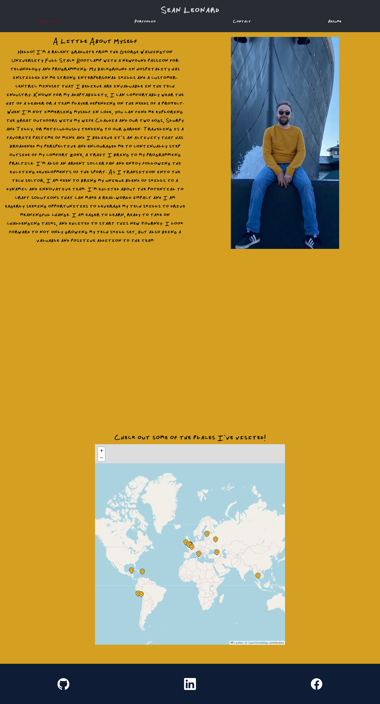

# Developer Profile & Getting Started with Create React App

This project was bootstrapped with [Create React App](https://github.com/facebook/create-react-app). It is designed to highlight myself as a person, a developer, and a potential team member to future employers. The portfolio is built with React, which has allowed me to practice and hone my skills using this technology.

## Table of Contents

- [Screenshot](#screenshot)
- [Description](#description)
- [Installation](#installation)
- [Usage](#usage)
- [Available Scripts](#available-scripts)
- [Credits](#credits)
- [Tests](#tests)
- [How to Contribute](#how-to-contribute)
- [Questions](#questions)
- [Create React App Additional Information](#create-react-app-additional-information)

## Screenshot

## Description

This portfolio provides an interactive way for users to learn about my professional journey, accomplishments, and abilities in web development.

## Installation

To install this project, clone the repository to your local machine, navigate to the project's directory. Run 'npm install' to install all necessary dependencies, and 'npm start' to start the development server and view the application in your default web browser.

## Usage

The project serves as a personal portfolio to showcase my skills, experiences, and educational background to potential employers or clients.

## Available Scripts

In the project directory, you can run:

### `npm start`

Runs the app in the development mode. Open [http://localhost:3000](http://localhost:3000) to view it in the browser. The page will reload if you make edits.

### `npm test`

Launches the test runner in the interactive watch mode.

### `npm run build`

Builds the app for production to the `build` folder. It correctly bundles React in production mode and optimizes the build for the best performance.

### `npm run eject`

Note: this is a one-way operation. Once you `eject`, you can’t go back!

## Credits

This project was bootstrapped with Create React App. Node.js and npm were used for the runtime environment and package management. Additional assistance came from W3 Schools and ChatGPT.

## Tests

To test this application, navigate to the project directory and execute 'npm test' to start the Jest test runner in interactive watch mode. This will automatically run tests when changes are detected.

## How to Contribute

Fork the repository and submit a pull request to contribute. Thank you!

## Questions?

Find me on GitHub @[sleonny](https://github.com/sleonny) or email me at leonardmsean@gmail.com.

## Create React App Additional Information

You can learn more in the [Create React App documentation](https://facebook.github.io/create-react-app/docs/getting-started).

To learn React, check out the [React documentation](https://reactjs.org/).

- [Code Splitting](https://facebook.github.io/create-react-app/docs/code-splitting)
- [Analyzing the Bundle Size](https://facebook.github.io/create-react-app/docs/analyzing-the-bundle-size)
- [Making a Progressive Web App](https://facebook.github.io/create-react-app/docs/making-a-progressive-web-app)
- [Advanced Configuration](https://facebook.github.io/create-react-app/docs/advanced-configuration)
- [Deployment](https://facebook.github.io/create-react-app/docs/deployment)
- [Troubleshooting](https://facebook.github.io/create-react-app/docs/troubleshooting#npm-run-build-fails-to-minify)
